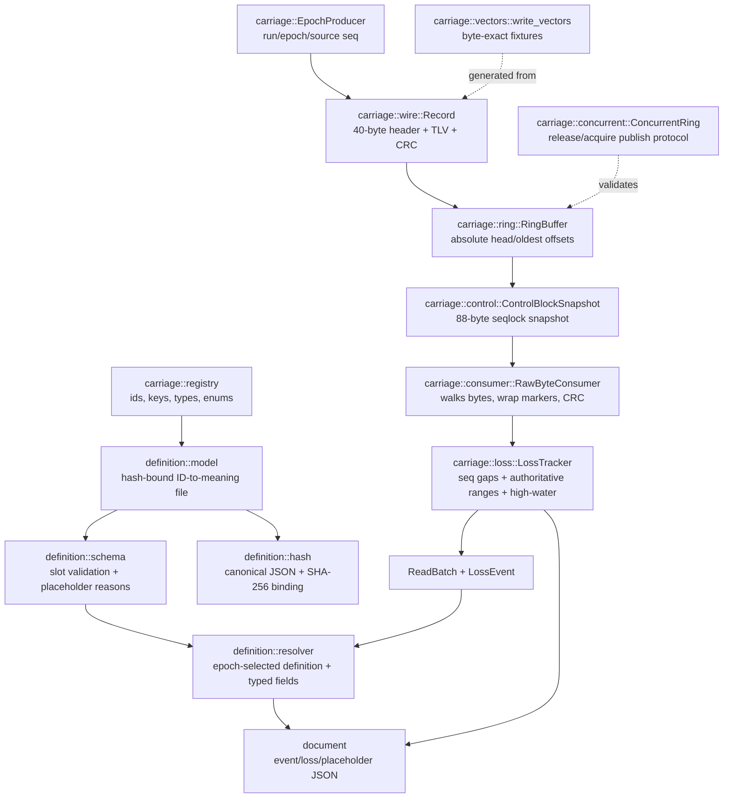
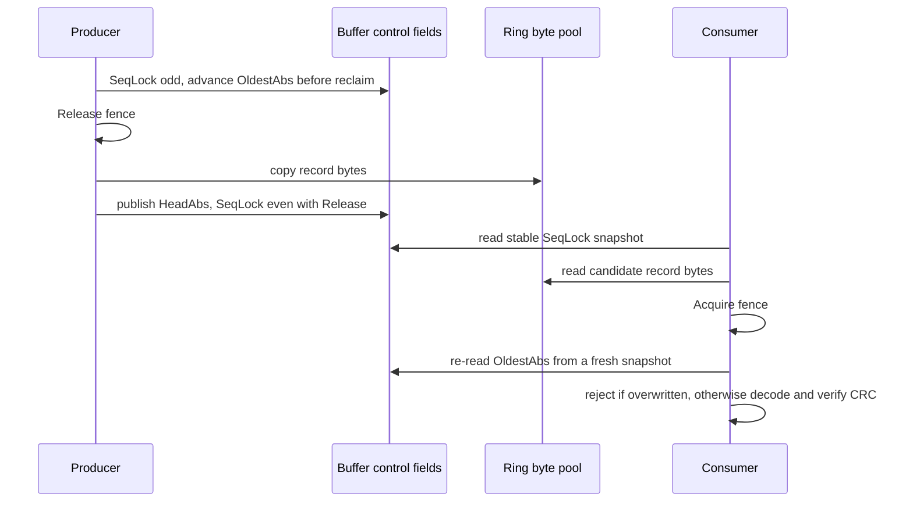

# Architecture

The crate is split by protocol responsibility. The implementation keeps encoding, storage, loss reconciliation, epoch handling, concurrency, and fixture generation separate so each rule can be tested directly.

## Module Boundaries

| Module | Responsibility | Kept out deliberately |
| --- | --- | --- |
| `crc` | CRC-32C calculation. | Record parsing, ring state, allocation policy. |
| `wire` | Binary record encode/decode and slot validation. | Buffer ownership, source sequencing, schema registry lookup. |
| `registry` | Provisional canonical event ids, value keys, and TLV type tags. | Runtime parsing and field semantics. |
| `ring` | Byte-pool ring behavior, wrap handling, and overwrite detection. | Loss accounting, epoch transitions, definition hashes. |
| `control` | Byte-exact shared-memory control block snapshot and seqlock validation. | Record parsing and producer vocabulary. |
| `loss` | Seq-gap, authoritative, and high-water loss accounting and the interval-merge math. | Reading the ring; byte-pool storage. |
| `consumer` | Index and raw-byte reading consumers that drive loss accounting. | Loss math internals and ring storage. |
| `epoch` | Run/epoch transitions, source sequence assignment, and source high-water checkpoints. | Raw byte parsing and concurrent memory ordering. |
| `concurrent` | Publish/read memory-ordering model for shared ring bytes. | Event vocabulary and definition-file semantics. |
| `vectors` | Deterministic fixture generation. | Hand-authored fixture bytes. |
| `definition::model` | Definition-file content model and sample positive spine. | Canonicalization, hashing, record resolution. |
| `definition::hash` | Duplicate-key/no-float parse guardrails, canonical JSON, and SHA-256 binding. | Schema validation and slot resolution. |
| `definition::schema` | Record/schema validation and placeholder reasons. | Naming/unit/enum resolution. |
| `definition::resolver` | Epoch-context hash selection, typed/named field resolution, and extension-field preservation. | Consumer document serialization. |
| `document` | Deterministic event/loss/placeholder JSON from resolver outputs and loss ranges. | Wire parsing, schema validation, and definition hashing. |

This follows a simple rule: a module owns one protocol concern and exposes the minimum data needed by the next layer. That keeps tests focused and prevents the carriage prototype from becoming a full product runtime.

## Publish And Read Protocol

The concurrent model validates the ordering rule needed when a consumer can observe PLC memory asynchronously.

The release fence before clobbering reclaimed bytes is not a performance decoration. It is the rule that makes the consumer's final `OldestAbs` re-check meaningful on weakly ordered systems. CRC catches mixed torn records; the oldest-offset re-check catches clean but stale records at a reclaimed absolute position.

## Design Constraints

- **SOLID:** each module has a single protocol reason to change. The ring does not know how definitions are produced; the wire codec does not know whether a source is a phase, alarm, or diagnostic emitter.
- **KISS:** the core uses ordinary Rust data structures and no runtime dependencies. `loom` is a dev-dependency used only for concurrency tests.
- **DRY:** byte fixtures are generated from the same encoder used by tests, not duplicated as hand-maintained hex.
- **Interop-oriented:** all public evidence is byte-level or behavior-level. The crate does not depend on one PLC vendor, code generator, or translator implementation.
